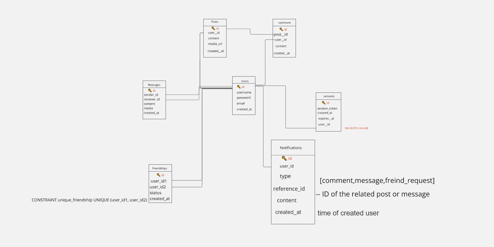

# GK--Chat
This app will get facebook and instgram and tiktok and whats app and twitter and snapchat and Bsky die : ) 🔥

# this graph for our project
      const progress = (snapshot.bytesTransferred / snapshot.totalBytes) * 100;
   

#Design
 <pre>

     const mongoose = require('mongoose');

// User Schema
const userSchema = new mongoose.Schema({
    username: { type: String, required: true },
    email: { type: String, required: true, unique: true },
    passwordHash: { type: String, required: true },
});

const User = mongoose.model('User', userSchema);

// Message Schema
const messageSchema = new mongoose.Schema({
    sender_id: { type: mongoose.Schema.Types.ObjectId, ref: 'User', required: true },
    recipient_id: { type: mongoose.Schema.Types.ObjectId, ref: 'User', required: true },
    content: { type: String, required: true },
    created_at: { type: Date, default: Date.now }
});

const Message = mongoose.model('Message', messageSchema);

// Friendship Schema
const friendshipSchema = new mongoose.Schema({
    user_id1: { type: mongoose.Schema.Types.ObjectId, ref: 'User', required: true },
    user_id2: { type: mongoose.Schema.Types.ObjectId, ref: 'User', required: true },
    created_at: { type: Date, default: Date.now }
});

friendshipSchema.index({ user_id1: 1, user_id2: 1 }, { unique: true }); // Ensure unique friendships

const Friendship = mongoose.model('Friendship', friendshipSchema);

// Notification Schema
const notificationSchema = new mongoose.Schema({
    user_id: { type: mongoose.Schema.Types.ObjectId, ref: 'User', required: true },
    type: { type: String, required: true }, // e.g., 'message', 'friend_request'
    reference_id: { type: mongoose.Schema.Types.ObjectId, required: true }, // e.g., message ID or post ID
    content: { type: String, required: true },
    created_at: { type: Date, default: Date.now }
});

const Notification = mongoose.model('Notification', notificationSchema);

// Session Schema
const sessionSchema = new mongoose.Schema({
    user_id: { type: mongoose.Schema.Types.ObjectId, ref: 'User', required: true },
    token: { type: String, required: true, unique: true },
    created_at: { type: Date, default: Date.now },
    expires_at: { type: Date, required: true }
});

const Session = mongoose.model('Session', sessionSchema);

module.exports = {
    User,
    Message,
    Friendship,
    Notification,
    Session
};
const { User, Message, Friendship, Notification, Session } = require('../models');

     
 </pre>

 <pre>

  #1. User Authentication and Registration
Registration Page:

Fields: Username, Email, Password
Buttons: Register, Redirect to Login
Functionality: Allows users to create a new account.
Login Page:

Fields: Email, Password
Buttons: Login, Redirect to Registration
Functionality: Allows users to log into their account.
Logout:

Button: Logout (visible when logged in)
Functionality: Ends the user session and returns to the login page.
#2. Main Chat Interface
Chat Interface:
User List: Displays online users or contacts.
Chat Area: Shows messages from the selected chat or chat room.
Message Input: Text input field to type messages.
Send Button: Sends the message to the selected chat or chat room.

#3. Chat Rooms and Private Messaging
Chat Rooms:

List of Rooms: Shows available chat rooms.
Room Interface: Messages and users in the selected room.
Join/Leave Buttons: Allows users to join or leave rooms.
Private Messaging:

User List: Allows selecting individual users for private conversations.
Private Chat Interface: Similar to the main chat interface but specific to the selected user.

#4. Chat History
Chat History:
Persistent Storage: Messages are stored in a database and loaded when the user revisits the chat or logs in.
Message Retrieval: Loads previous messages when joining a chat room or private conversation.

  
 </pre>
    e.preventDefault()
 const formData = new FormData(e.target)

 const {username,email,password} = Object.fromEntries(formData)
    toast.success("hello")
    console.log(username)
} get the data by name 
